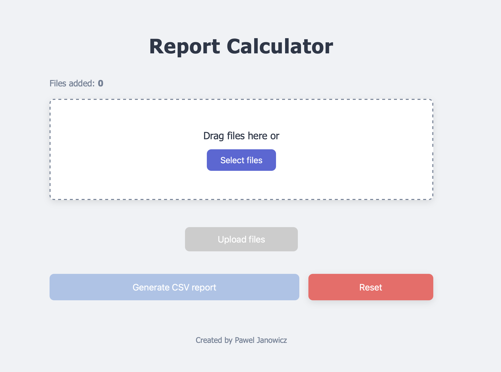
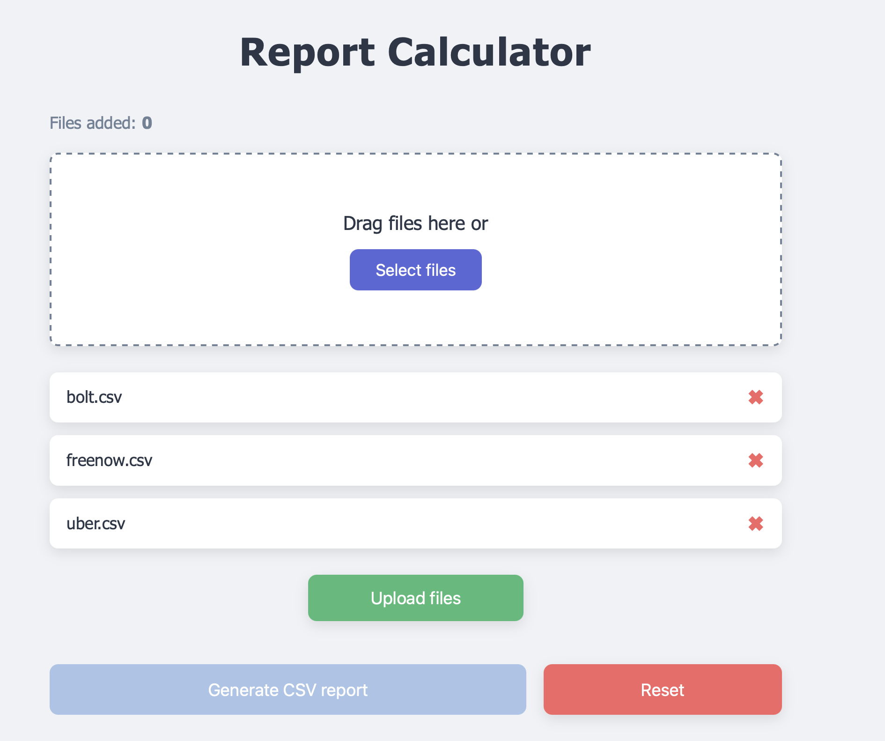
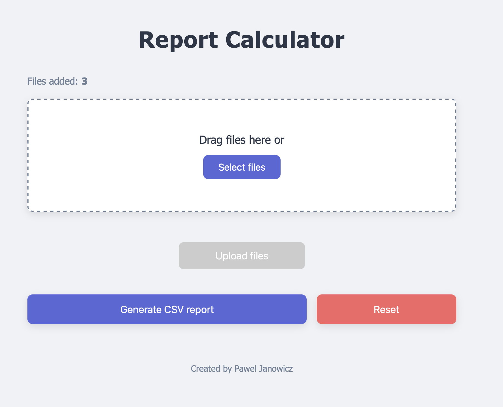
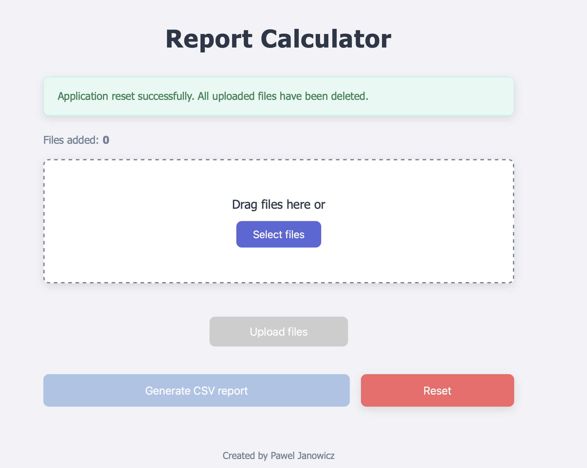
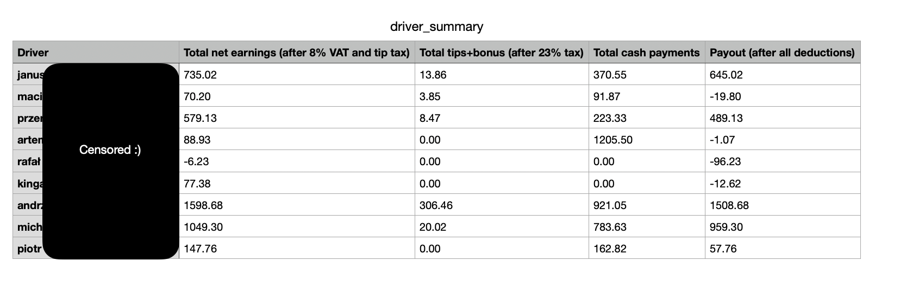

## :bookmark_tabs: About This Project

Driver Report Calculator is a Spring Boot application that processes CSV exports from Bolt, Uber, and FreeNow, then calculates each driver’s final payout by applying VAT, tip tax, cash deductions, rental fees, splits, and bonuses via a Thymeleaf‐based UI.

## :hammer_and_wrench: Used Technologies

* Java 17 
* Spring Boot 3.5.0  
* Thymeleaf  
* Apache Commons CSV  
* Maven  

## :camera: Screenshots

Initial view | Files added 
:------------------------:|:-------------------------:  
  |    

Report ready to generate | After deletion  
:------------------------:|:-------------------------: 
  |  

Generated report |  
:------------------------:
   |    
